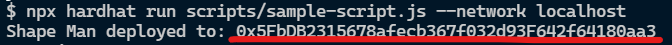

# Shape man - NFT project

This project is build by hardhat & vite react.
Images are deployed on the [Pinata](https://www.pinata.cloud/) a IFPS file system.
Smart contract is deployed on the Polygon test net **mumbai** by [Alchemy](https://www.alchemy.com/)
And final, website is deployed on the firebase.


<span style="color:red">❗IMPORTANT❗ It is a test project. There are no real sales. </span>


[Click me to see how it work](https://shape-man.okesseko.tk/)

[Step by step mint tutorial](https://personal-website-dcard.okesseko.tk/post/2)

## Start project
Follow the step you can create your own NFT project.

```
git clone <this-repo>
npm install
```

### Create the images & deployed
To create your NFT images and deployed to [Pinata](https://www.pinata.cloud/) you can follow this project  [NFT generate project](https://github.com/okesseko/nft-art-generator)

### Start the test node
```
npm run test-node
```

### Compile & deployed smart contract

```
npm run compile

// deployed on localhost testnet
npm run deploy --network localhost

// deployed on other net
npm run deploy --network <other-net>

```
For deployed to other net. You can follow [hardhat config](https://hardhat.org/config/)

You will get the contract's address on terminal



### Setting the .env file
Create the .env file & setting like this
```
// .env file

VITE_CONTRACT_ADDRESS = <deployed-contract-address>
VITE_PINATA_ID = <pinata-images-cid>
```


### Open the website
```
npm run dev
```

Now enjoy your NFT project 😊
